# SmartThings Family Hub Fridge Camera Integration for Home Assistant

This is a custom integration to output SmartThings Family Hub fridge camera feeds in [HomeAssistant](https://home-assistant.io).

<p float="left">
  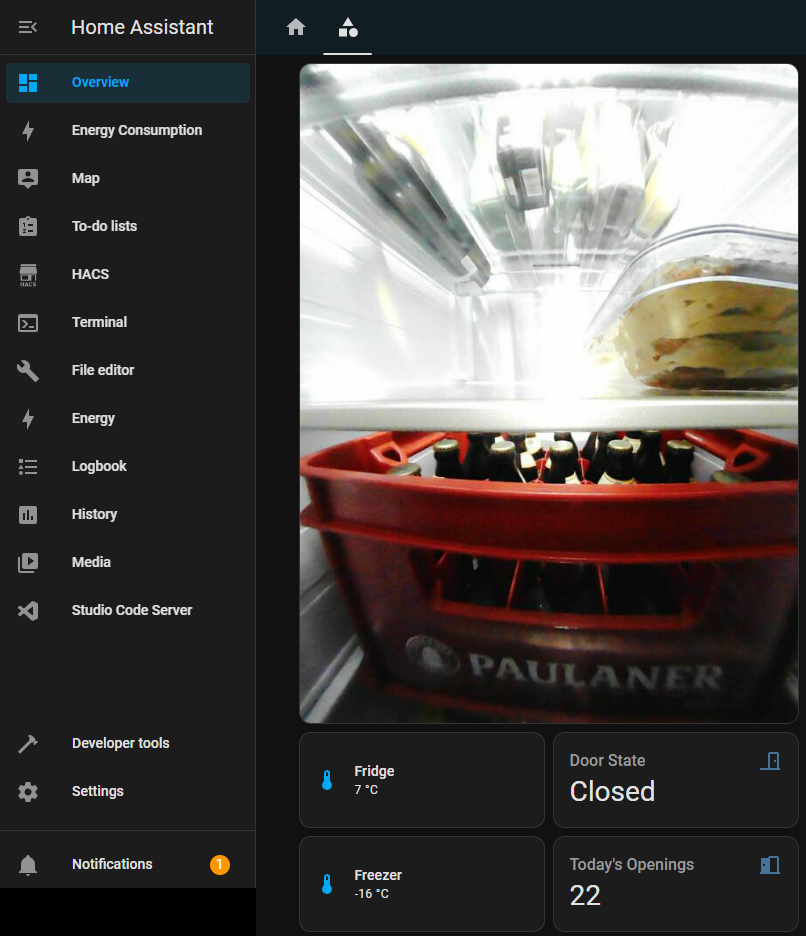
</p>

**Please be aware that this implementation is a proof of concept. Don't expect everything to work!**

# Installation

When it comes to the installation, you have two options:
- Option 1: Install via HACS
- Option 2: Manual Installation

## Option 1: Install via HACS

First, navigate to the HACS tab on your Home Assistant instance. On this page, click the three dots in the top right corner and select "Custom repositories":
<p float="left">
  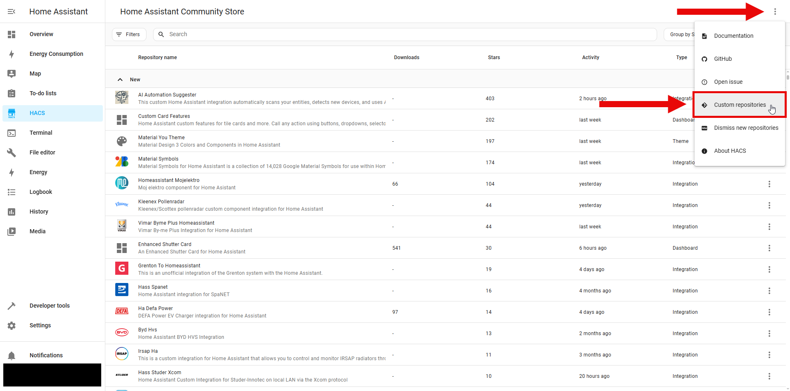
</p>


In the floating window, please enter the link to the repository and select "Integration" as the type. (Just copy the link from the browser as shown)
<p float="left">
  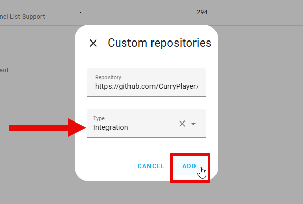
  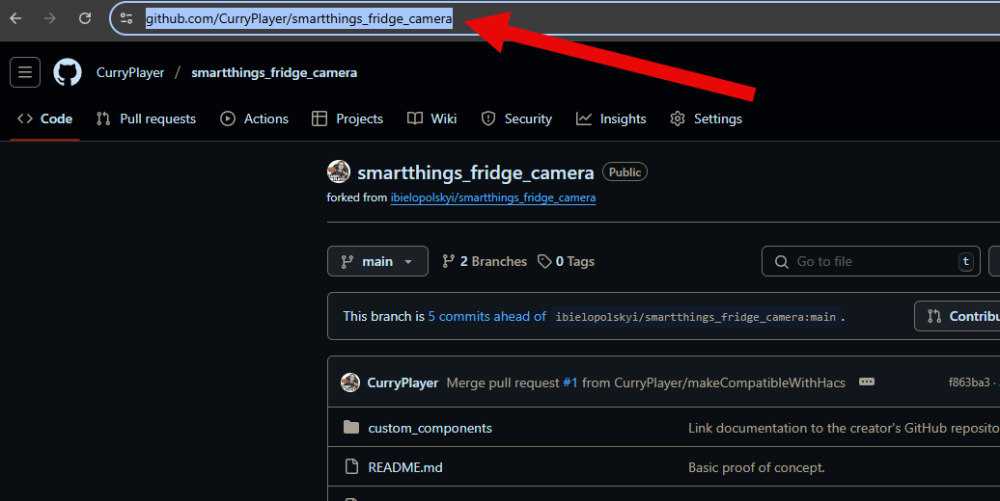
</p>


After clicking the "Add" button, the repository should be added at the top as follows:
<p float="left">
  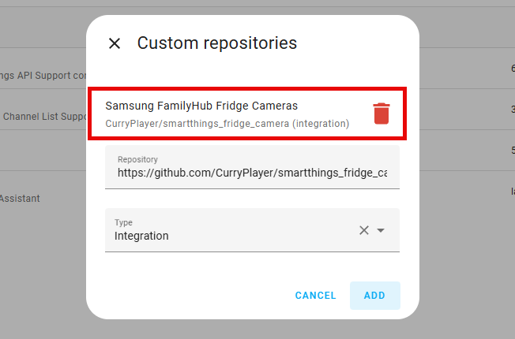
</p>


Next, search for your recently added repository in the HACS search bar and click on it:
<p float="left">
  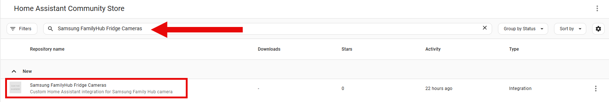
</p>


Click the "Download" button in the bottom right:
<p float="left">
  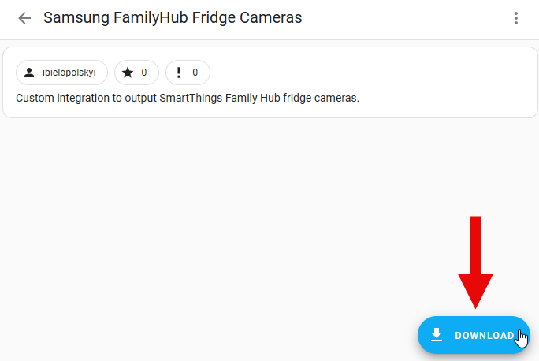
</p>


Confirm the download of the latest version by clicking "Download". If everything works, you should see a success message afterwards:
<p float="left">
  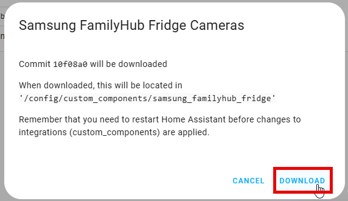
</p>


### !!! Please restart Home Assistant for the changes to take effect !!!


### CONGRATULATIONS <3

You have successfully added the integration to your Home Assistant instance.


## Option 2: Manual Installation

Install it as you would do with any Home Assistant custom component:

1. Download the `custom_components` folder from the repository.
2. Copy the `samsung_familyhub_fridge` directory into the `custom_components` directory of your Home Assistant installation. The `custom_components` directory resides within your Home Assistant configuration directory.</br>
**Note**: if the `custom_components` directory does not exist, you need to create it.
After a correct installation, your configuration directory should look like the following:
    ```
    └── ...
    └── configuration.yaml
    └── custom_components
        └── samsung_familyhub_fridge
            └── __init__.py
            └── manifest.json
            └── api.py
            └── camera.py
            └── ...
    ```

For reference:
<p float="left">
  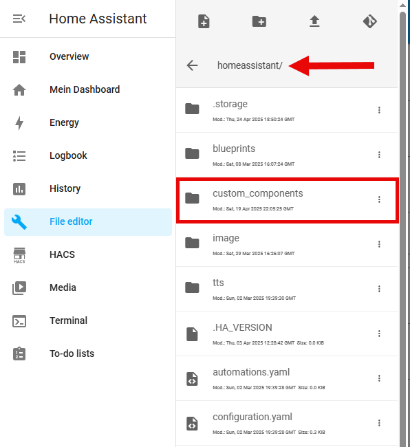
  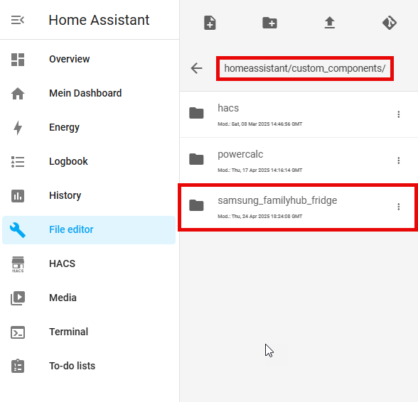
</p>

### !!! Make sure to reboot Home Assistant after importing all files !!!


# Configuration

After the installation was successful, you can now configure the integration.

Navigate to "Settings" > "Devices & service":
<p float="left">
  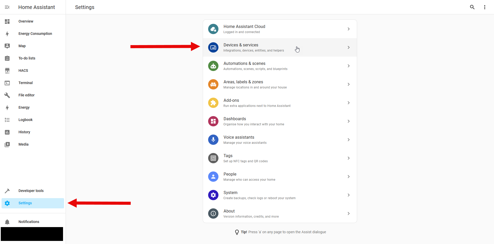
</p>


Click "Add Integration" in the bottom right:
<p float="left">
  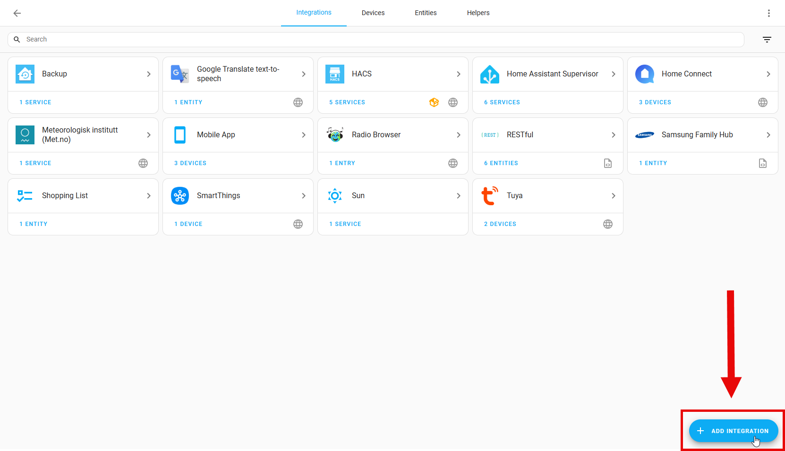
</p>


Search for the FamilyHub Integration you just downloaded and select it:
<p float="left">
  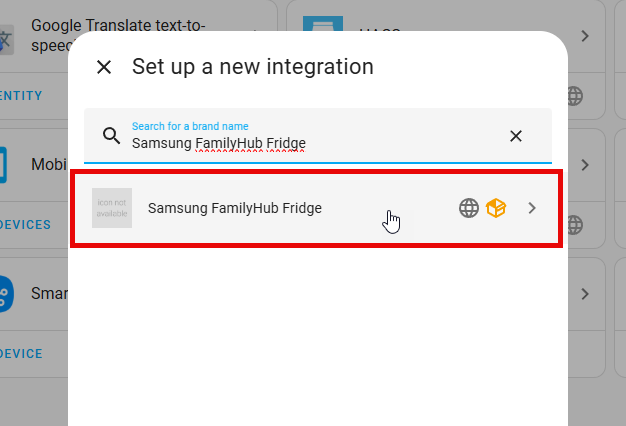
</p>


You need to enter your Smartthings Token and your Device ID. The token is used to access your SmartThings account. The device ID identifies your fridge.</br>
You can create a token from here: https://account.smartthings.com/tokens.</br>
And get your device ID from here: https://my.smartthings.com/advanced/devices.</br>
Click "Submit" to finish the setup:
<p float="left">
  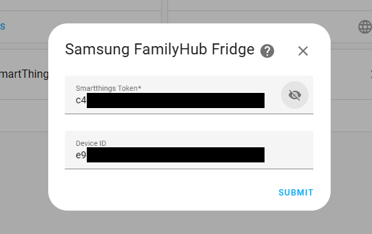
</p>


If everything worked, you should see a success message:
<p float="left">
  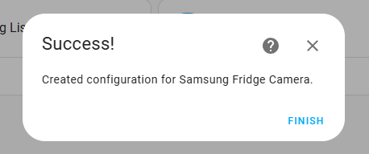
</p>


Now let's add the camera to your dashboard. Navigate to your dashboard and add a card. Select the "Picture entity" card:
<p float="left">
  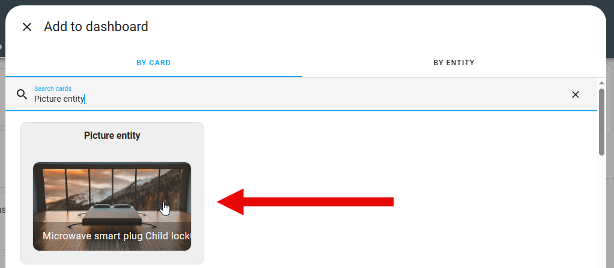
</p>


As the entity, you need to select your camera. You will see more than one camera entity. Just select the one that is working for you:
<p float="left">
  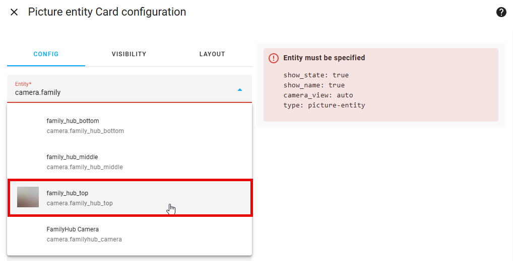
</p>


Make sure to select the additional settings as follows and click "Save":
<p float="left">
  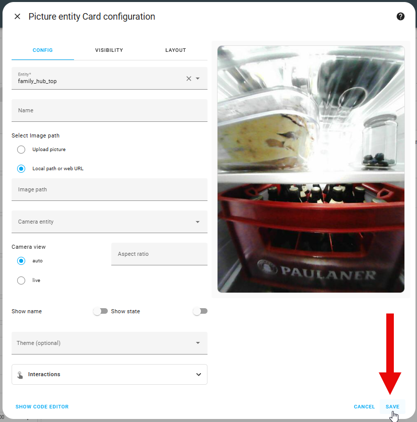
</p>


Credits
-------

This integration was developed by [ibielopolskyi][ibielopolskyi].<br/>
HACS integration was added by [CurryPlayer][curryplayer].<br/>
Special thanks to [HalloTschuess][hallotschuess].<br/>

[ibielopolskyi]: https://github.com/ibielopolskyi
[curryplayer]: https://github.com/CurryPlayer
[hallotschuess]: https://github.com/HalloTschuess