# SmartThings Family Hub Fridge Camera Integration for Home Assistant

This is a custom integration to output SmartThings Family Hub fridge camera feeds in [HomeAssistant](https://home-assistant.io).

<p float="left">
  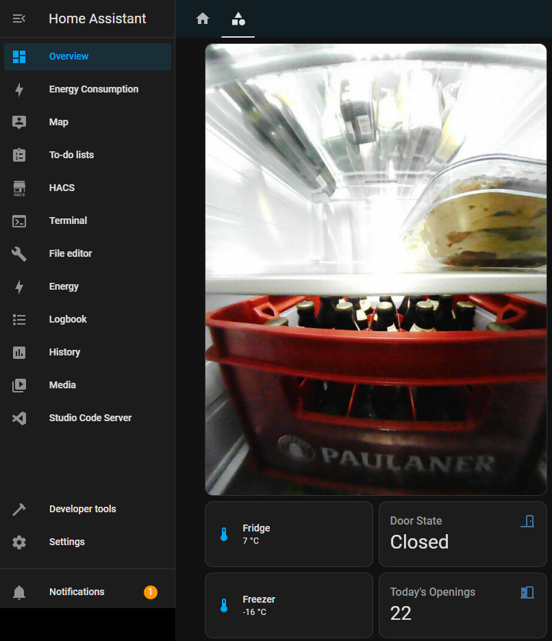
</p>

**Please be aware that this implementation is a proof of concept. Don't expect everything to work!**

# Installation

When it comes to the installation, you have two options:
- Option 1: Install via HACS
- Option 2: Manual Installation

## Option 1: Install via HACS

First, navigate to the HACS tab on your Home Assistant instance. On this page, click the three dots in the top right corner and select "Custom repositories":
<p float="left">
  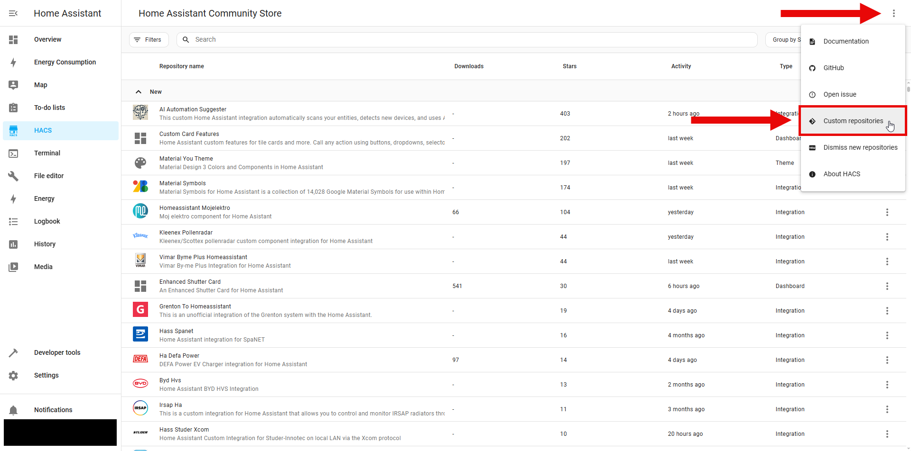
</p>


In the floating window, please enter the link to the repository and select "Integration" as the type. (Just copy the link from the browser as shown)
<p float="left">
  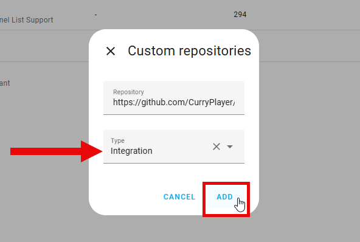
  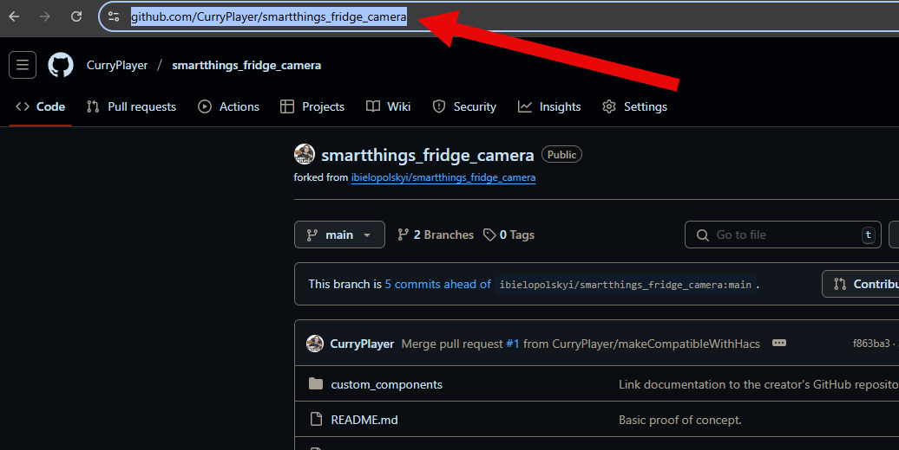
</p>


After clicking the "Add" button, the repository should be added at the top as follows:
<p float="left">
  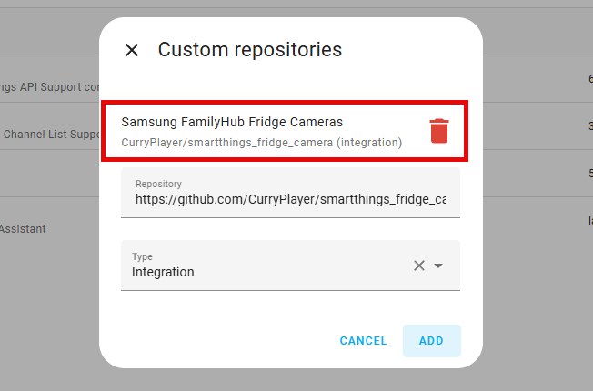
</p>


Next, search for your recently added repository in the HACS search bar and click on it:
<p float="left">
  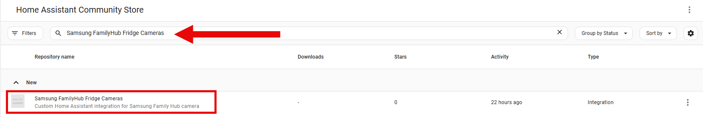
</p>


Click the "Download" button in the bottom right:
<p float="left">
  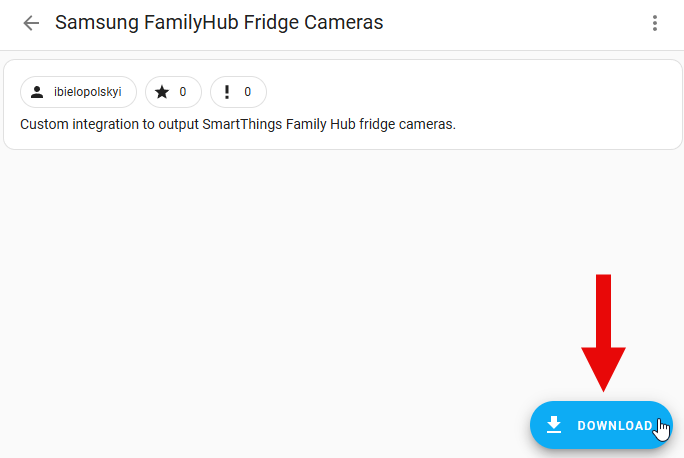
</p>


Confirm the download of the latest version by clicking "Download". If everything works, you should see a success message afterwards:
<p float="left">
  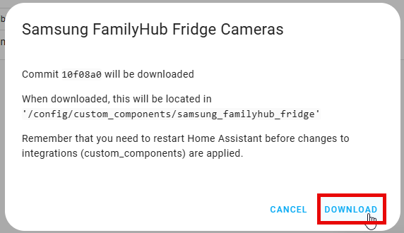
</p>


### !!! Please restart Home Assistant for the changes to take effect !!!


### CONGRATULATIONS <3

You have successfully added the integration to your Home Assistant instance.


## Option 2: Manual Installation

Install it as you would do with any Home Assistant custom component:

1. Download the `custom_components` folder from the repository.
2. Copy the `samsung_familyhub_fridge` directory into the `custom_components` directory of your Home Assistant installation. The `custom_components` directory resides within your Home Assistant configuration directory.</br>
**Note**: if the `custom_components` directory does not exist, you need to create it.
After a correct installation, your configuration directory should look like the following:
    ```
    └── ...
    └── configuration.yaml
    └── custom_components
        └── samsung_familyhub_fridge
            └── __init__.py
            └── manifest.json
            └── api.py
            └── camera.py
            └── ...
    ```

For reference:
<p float="left">
  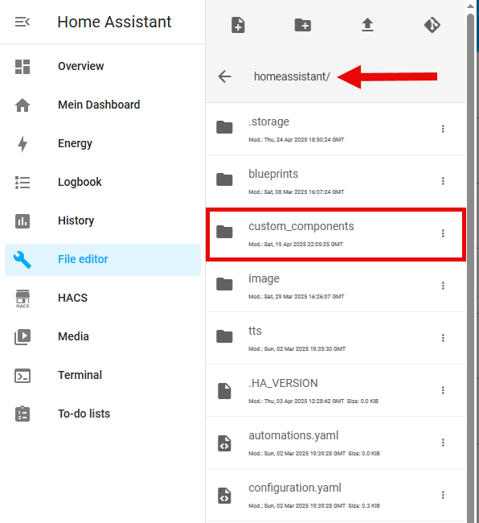
  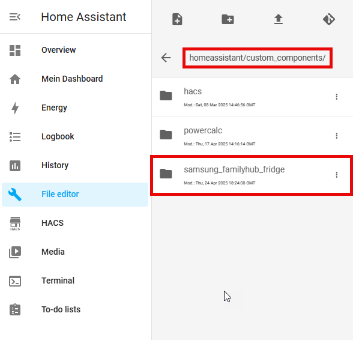
</p>

### !!! Make sure to reboot Home Assistant after importing all files !!!


# Configuration

After the installation was successful, you can now configure the integration.

Navigate to "Settings" > "Devices & service":
<p float="left">
  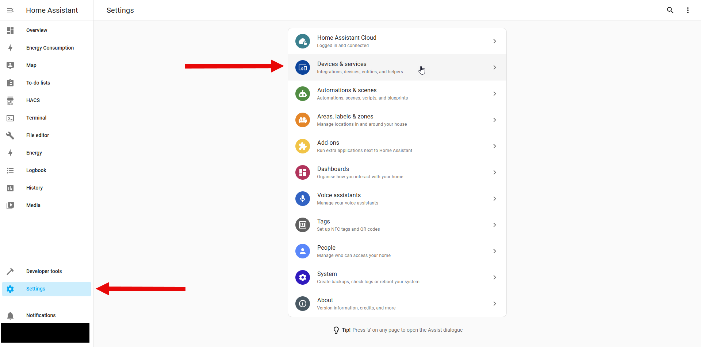
</p>


Click "Add Integration" in the bottom right:
<p float="left">
  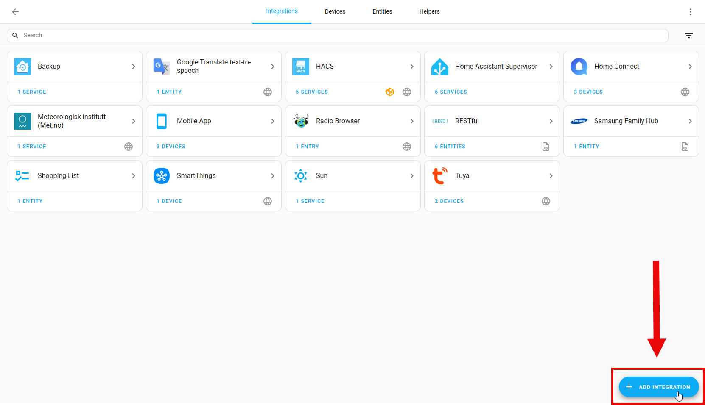
</p>


Search for the FamilyHub Integration you just downloaded and select it:
<p float="left">
  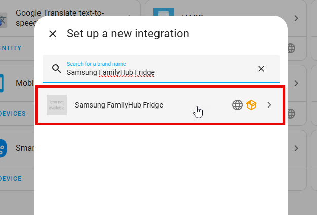
</p>


## Authentication options

Family Hub camera images are fetched through Samsung's `client.smartthings.com` image endpoints. Home Assistant's built-in SmartThings OAuth token can still work for normal SmartThings API calls, but it may not include the Samsung account identity required by the Family Hub image endpoint. When that happens, Samsung returns:

```text
No samsung id available
```

Recommended setup paths:

- **Samsung client bearer token for Family Hub image endpoint**: use this when OAuth reuse fails for images. You must provide your fridge `device_id`, the `cid`, and a valid Samsung/SmartThings client bearer token. The token field accepts either the raw token or a value beginning with `Bearer `.
- **Legacy SmartThings Personal Access Token**: use this if you still have a PAT that works for your account and device. New PATs may expire quickly.
- **Reuse HA core SmartThings OAuth**: useful for normal SmartThings OAuth reuse, but it may not work for Family Hub camera images if Samsung reports that no Samsung ID is available.

The Samsung client bearer token mode requires:

- `device_id`: the SmartThings device ID for your fridge.
- `cid`: the client ID value required by the Samsung Family Hub image file-link endpoint.
- `token`: your valid Samsung client bearer token.

Do not share bearer tokens or PATs publicly. Treat them like passwords.

The camera `fileId` rotates roughly every 10 minutes. The integration re-fetches the fridge device JSON before each image download and does not permanently cache `fileId` values. Token lifetime for Samsung client bearer tokens is not known; if images stop refreshing and Home Assistant asks for reauthentication, update the token, `cid`, or `device_id` from the integration options/reauth flow instead of deleting the integration.

This project does not include instructions for bypassing certificate pinning, scraping browser cookies, or extracting private app traffic. You need to supply your own valid Samsung client bearer token and `cid`.

You need to enter your authentication details and your Device ID. The token is used to access your SmartThings/Samsung account. The device ID identifies your fridge.</br>
For legacy PAT mode, you can create a token from here: https://account.smartthings.com/tokens.</br>
You can get your device ID from here: https://my.smartthings.com/advanced/devices.</br>
Click "Submit" to finish the setup:
<p float="left">
  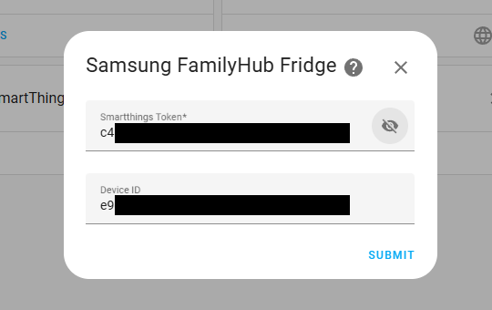
</p>


If everything worked, you should see a success message:
<p float="left">
  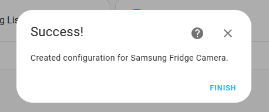
</p>


Now let's add the camera to your dashboard. Navigate to your dashboard and add a card. Select the "Picture entity" card:
<p float="left">
  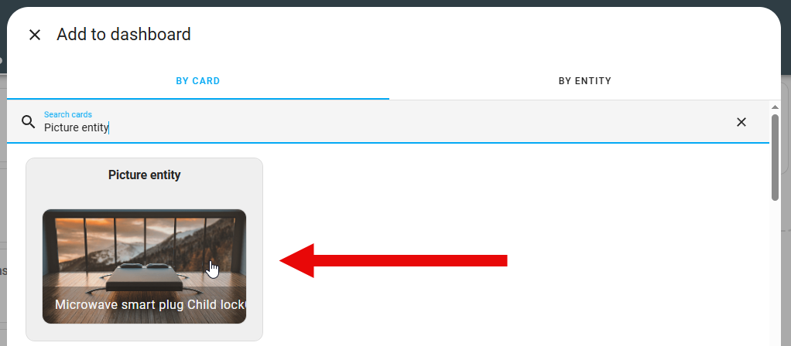
</p>


As the entity, you need to select your camera. You will see more than one camera entity. Just select the one that is working for you:
<p float="left">
  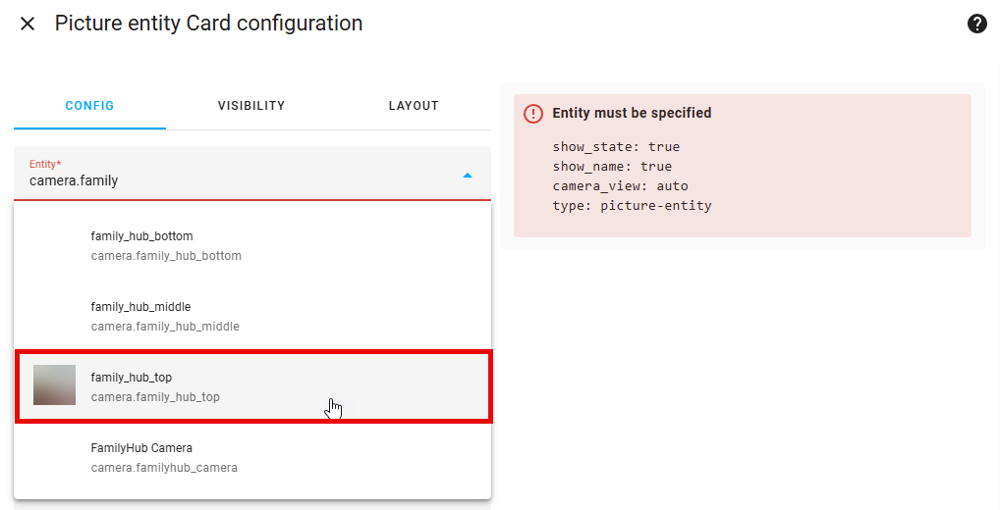
</p>


Make sure to select the additional settings as follows and click "Save":
<p float="left">
  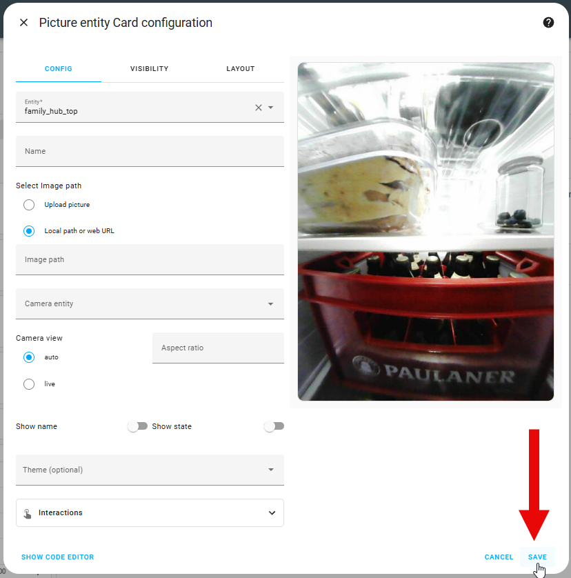
</p>


Credits
-------

This integration was developed by [ibielopolskyi][ibielopolskyi].<br/>
HACS integration was added by [CurryPlayer][curryplayer].<br/>
Special thanks to [HalloTschuess][hallotschuess].<br/>

[ibielopolskyi]: https://github.com/ibielopolskyi
[curryplayer]: https://github.com/CurryPlayer
[hallotschuess]: https://github.com/HalloTschuess
